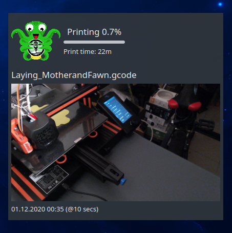
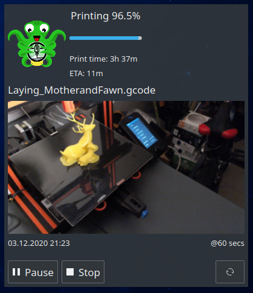

# OctoPrint Monitor for KDE 5 / Plasma #

## Table of contents ##

 * [Introduction](#introduction)
 * [Features](#features)
 * [Screenshots](#screenshots)
 * [State icons](docs/states.md)
 * [Installation and configuration](docs/setup.md)
 * [Troubleshooting](docs/troubles.md)
 * [License](#license)
 * [Changelog](CHANGES.md)

---

## Introduction ##

`OctoPrint Monitor` is Plasma (KDE5/QT) plasmoid designed to continously monitor your 3D printer controlled
by [OctoPrint](https://octoprint.org) software and update you on any state change, incl. progress the printing,
errors or other state changes. 

It comes with various layouts types suitable for different installation locations. Compact one comes
useful when you want it to sit directly in your panel bar (be it vertical or horizontal) and bigger,
feature-rich (including embeedded Octoprint camera view) to be placed as widget on your desktop.
Multiple configuration options let you tweak it as you like.

---

## Features ##

- Compact layout for in-panel installation
- Rich layout for desktop widget
- Graphical representation of your 3D printer states
- State and progress of on-going printing job
- Optional "live" Webcam view directly in the widget
- Can report printer temperatures (bed, hotends, etc).
- Extensively configurable

---

## Screenshots ##

Sometimes one picture is worth more bunch of words, so here we go:

### Idle vertical panel widget ###

`OctoPrint Monitor` sitting in vertical panel. More detailed information (incl. bed and hotend temperatures) are 
provided in a tooltop, available once you hoover your mouse over the widget.

### Idle vertical panel widget ###

This instance is configured to not display text state when printer is `Idle`.
The same detailed information provided in tooltip.

### Printing in progress in vertical panel widget ###

Printing in progress. Different icon, additional print progress percentage and graphical progress
bar below. Each and every element can be turned on or off, like seen on image below, where both progress
bar and textual state is disabled, but progress percentage is kept enabled.

You can also control the size of status icon (it stretches to panel dimensions by default, but
can be scaled down, as seen of the above images). You can even disable the icon completely.

### Idle desktop widget ###

`OctoPrint Monitor` installed as desktop widget. Printer is in `Idle` state, and widget is configured to NOT
update webcam view in such case (hence 'STOPPED' mark next to screenshot timestamp).

### Printing desktop widget ###

Widget now shows additional infomation related to ongoing printing job.

### Camera view manual controls ###

Since v1.2.0 you can manually refresh camera view or pause it on demand.

---

## License ##

 * Written and copyrighted &copy;2020 by Marcin Orlowski <mail (#) marcinorlowski (.) com>
 * OctoPrint Monitor is open-sourced software licensed under the [MIT license](http://opensource.org/licenses/MIT)
