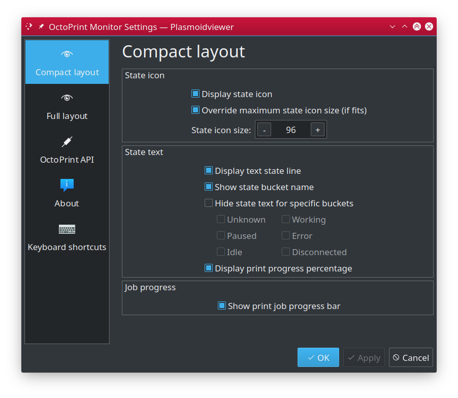
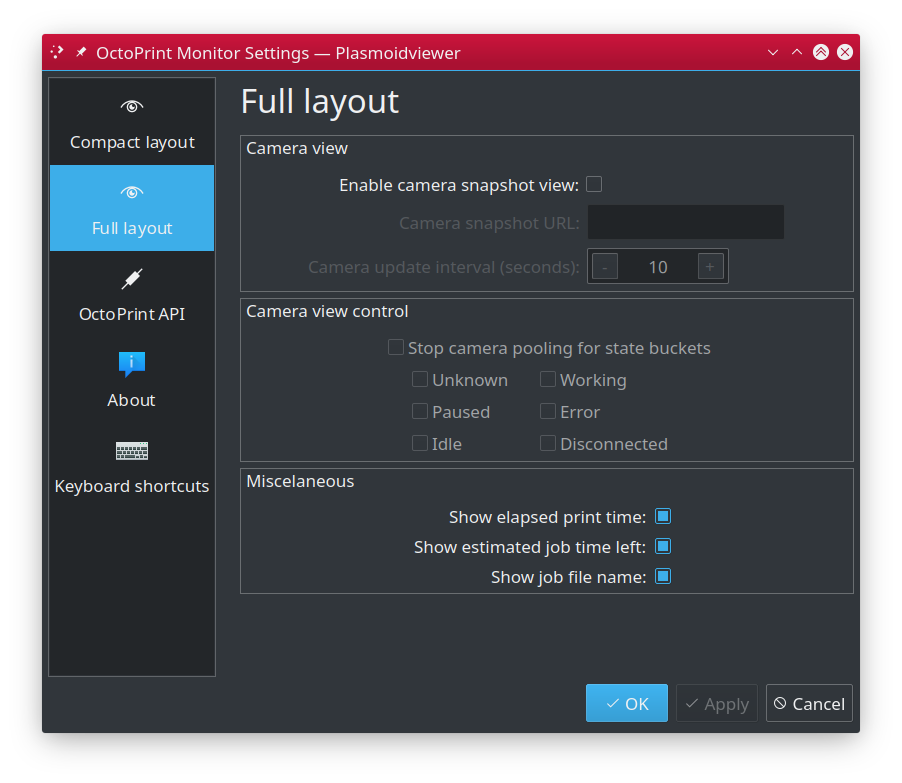
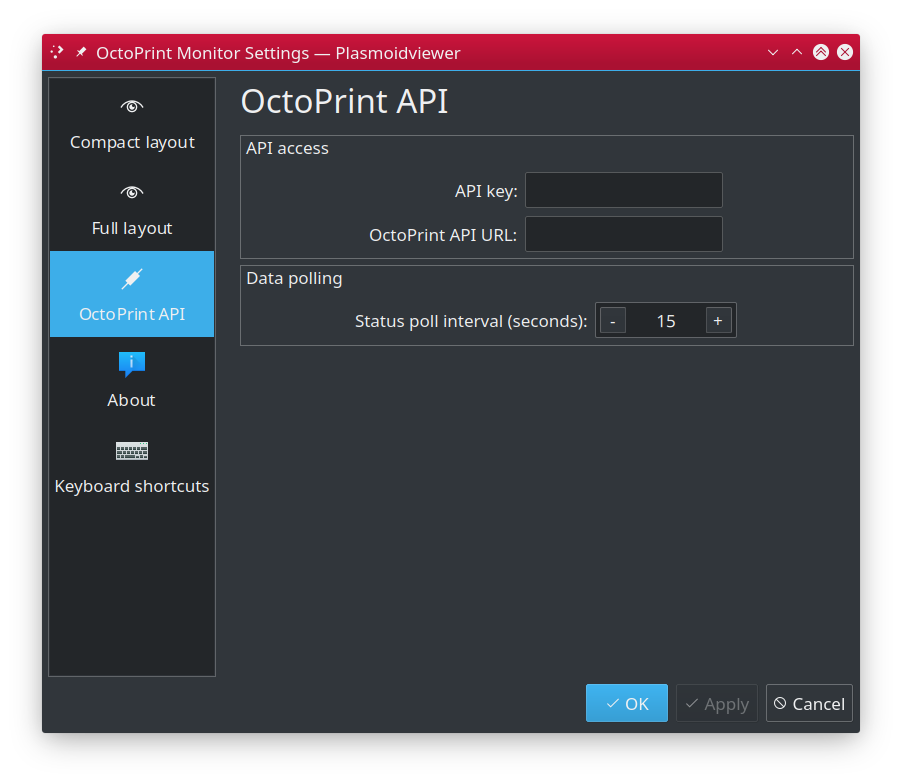

# OctoPrint Monitor for KDE 5 / Plasma #

## Table of contents ##

 * [Introduction](#introduction)
 * [Features](#features)
 * [Screenshots](#screenshots)
 * [State icons](#state-icons)
 * [Configuration](#configuration)
 * [Installation](#installation)
 * [Upgrading](#upgrading)
 * [License](#license)
 * [Changelog](CHANGES.md)

## Introduction ##

`OctoPrint Monitor` is Plasma (KDE5/QT) plasmoid designed to continously monitor your 3D printer controlled
by [OctoPrint](https://octoprint.org) software and update you on any state change, incl. progress the printing,
errors or other state changes. 

It comes with various layouts types suitable for different installation locations. Compact one comes
useful when you want it to sit directly in your panel bar (be it vertical or horizontal) and bigger,
feature-rich (including embeedded Octoprint camera view) to be placed as widget on your desktop.
Multiple configuration options let you tweak it as you like.

## Features ##

- Compact layout for in-panel installation
- Rich layout for desktop widget
- Graphical representation of your 3D printer states
- State and progress of on-going printing job
- Optional "live" Webcam view directly in the widget
- Can report printer temperatures (bed, hotends, etc).
- Extensively configurable

---

## Screenshots ##

Sometimes one picture is worth more bunch of words, so here we go:

### Idle vertical panel widget ###

`OctoPrint Monitor` sitting in vertical panel. More detailed information (incl. bed and hotend temperatures) are 
provided in a tooltop, available once you hoover your mouse over the widget.

### Idle vertical panel widget ###

This instance is configured to not display text state when printer is `Idle`.
The same detailed information provided in tooltip.

### Printing in progress in vertical panel widget ###

Printing in progress. Different icon, additional print progress percentage and graphical progress
bar below. Each and every element can be turned on or off, like seen on image below, where both progress
bar and textual state is disabled, but progress percentage is kept enabled.

You can also control the size of status icon (it stretches to panel dimensions by default, but
can be scaled down, as seen of the above images). You can even disable the icon completely.

### Idle desktop widget ###

`OctoPrint Monitor` installed as desktop widget. Printer is in `Idle` state, and widget is configured to NOT
update webcam view in such case (hence 'STOPPED' mark next to screenshot timestamp).

---

## State icons ##

`OctoPrint Monitor` aggregates printer and printing job states and produces uniform state reported to you.
For simplicity, we map multiple states into limited number of "state buckets", with dedicated, distinguishable
icon associated. While plain text state report is also available, different icons (additionally, color coded)
help you instantly know the state with just quick look. Detailed information are also available. 

You can face following icons, which representing different type of state.

### Idle ###
 The **Idle** state means connection to API is good and printer is 
currently connected to OctoPrint but is not printing anything, sitting idle and wasting electricity.

### Working ###
 The **Working** state indicates printer is currently busy working. For that state textual
state indicates state of current print job (i.e. "Finishing"). When printer is printing, additional information
such as progress indicators (both text "Printing (25,1%)" and graphics) will be provided. 

### Paused ###
 **Paused** sate tells, the printer is still occupied, but current print job
was paused by user..

### Disconnected ###
 The **Disconnected** state means your printer appears to no longer
be connected with the OctoPrint (or vice versa). This usually means USB cable was disconnected or printer
was simply turned off. OctoPrint in other hand is still up and `OctoPrint Monitor` has no problems talking
to it. Otherwise it would not know the printer went off-line, isnt' it?

### Error ###
 The **Error** state usually means OctoPrint cannot succesfuly talk to the
printer. In most cases this can be related to USB cable falling off its port. 

### Unavailable ###
 The **Unavailable** state indicates API connection issues. If for any reason
`OctoPrint Monitor` is unable to talk to OctoPrint API, it will flag this by using "Unavailable" state. In
most cases it will tell that OctoPrint instance is down or that `OctoPrint Monitor` is incorrectly configured
(most likely double check API URLs). It also can mean connection issues.  

### Unknown ###
 The **Unknown** state is represented by confused rainbow octopus and simply
indicates that `OctoPrint Monitor` is simply unable to correctly determine what is the current state of your printer.
This should only happened during plasmoid's start-up  phase, as it shows "Unknown" state icon unless first API call
is successful. If you see this during normal usage, please fill a bug report as it should not really happen.

---

## Configuration ##

### Compact layout ###

This section controls behaviour of the widgets when it is presented in compact form, which is 
used when you put it into your vertical or horizontal panel.

 - **State icon** - graphical state representation (octopus icons)
   - **Disable state icon** - controls visibility of state icon. 
   - **Override maximum state icon size** - by default visible state icons adapts its size to
   dimensions of the container it sits in. In some cases, esp. with vertical panels this may
   cause icon to occupy too much space for no actual benefits. This option lets you set
   max allowed icon size and if the container is bigger, then icon will not grow beyong
   specified dimensions.

- **State text** - textual representation of state
  - **Display text state line** - controls visibility of text state shown usually below the icon.
  This line ususally contains just state bucket name (i.e. "Idle") and print job progress
  percentage (if print job is currently ongoing). Disabling this element hides both types
  of presented information.
  - **Show state bucket name** - you may want to disable state name completely, w/o affecting
  other information presented in this line. If this option is enabled you will not see any
  state info but you may still see the progress percentage.
  - **Hide state text for specific buckets** - you may want to hide this information
  for specific states only to make widgets as small as possible.
  - **Display print progress percentage** - if enabled, will as name indicates show
  percentage of ongoing print job. If nothing is being printed, this element is hidden.

- **Job progress**
  - **Show print job progress bar** - if enabled, small progress bar will be shown as
  soon as print job is started.

> **HINT:** with default settings, active print job is presented as "Printing 12.1%",
> which is somehow redundant as percentage is only shown for active print job. You may
> want to enable "Hide state text for specific buckets" for "Working" bucket. That way
> you will still see all the state names as before, but for printing it will be just
> "12.1%".
  
### Full layout ###

Full layout is being used when `OctoPrint Monitor` is used as regular desktop widget.

 - **Camera view**
   - **Enable camera snapshot view** - if your setup includes OctoPrint connected webcam
   then you may enable this option in `OctoPrint Monitor` to show frequently updated
   snapshots from your webcam directly on your desktop.
   - **Camera snapshot URL** - complete address to OctoPrint snapshot feature. By default
   it should be `http://<OCTOPRINT>/webcam/?action=snapshot` where `<OCTOPRINT>` is either
   IP address of your OctoPrint instance or its domain name (i.e. `octoprint.local` that
   you use). You can find that URL in OctoPrint settings in "Webcam and timelapse" section.
   **NOTE:** note, that OctoPrint uses `127.0.0.1` as IP address in default settings. This
   will of course not work if copied - you must replace `127.0.0.1` by proper IP address
   of your OctoPrint.
   - **Camera update intervals** - specify how frequently you want webcam snapshot view
   to be updated. You may want to increase the interval, to reduce network traffic and
   drop the load off OctoPrint.
   - **Stop camera polling for state buckets** - if enabled, camera snapshot polling
   will stop if printer enters selected states. You may want to i.e. enable this
   option for i.e. "Idle" and "Disconnected" states as most likely there will be nothing
   interesting to watch in these states.  
 - **Misclaneous**
   - **Show elapsed print time** - contrils visibiliy of elapsed print time. If there's
   no print job in progress, this info is hidden.
   - **Show estimated job time left** - displays **estimated** time needed to complete
   ongoing print. This information comes from OctoPrint and, unfortunatelly is often
   not very accurate, so to speak. You may want to disable it and using percentage
   or progress bar instead. If there's no print job in progress, this info is hidden.
   - **Show job file name** - if enabled, name of currently printer GCODE file will
   be shown in the widget. If there's no print job in progress, this info is hidden.
   
 **NOTE:** You must configure OctoPrint properly and ensure its snapshot URL is accessible
 form other machines in your network (simply check using your browser).   

## OctoPrint API ##

Configure OctoPrint API access here.

 - **API access**
   - **API key** - put OctoPrint "Global API Access Key" here (can be found in "API"
   section of OctoPrint preferences).
   - **OctoPrint API URL** - put full URL to your OctoPrint REST API. This is usually
   construced as `http://<OCTOPRINT>/api` where `<OCTOPRINT>` is IP address or domain
   name of your OctoPrint installation.
 - **Data polling**
   - **Status poll interval** - controls how often `OctoPrint Monitor` will query
   OctoPrint about its status and the printer. 

---

## Installation ##

Download `octoprint-monitor.plasmoid` file from Release section. Then you can install it either
via Panel's GUI, by clicking "Add widgets", then "Get new widgets..." on the bottom
of newly opened widget chooser, then click "Install from local file..." and eventually selecting
downloaded `octoprint-monitor.plasmoid` file.

Alternatively you can install it from command line, by using `kpackagetool5` in your terminal:

    kpackagetool5 --install /PATH/TO/DOWNLOADED/octoprint-monitor.plasmoid 

## Upgrading ##

If you already have `OctoPrint Monitor` installed and just downloaded newer `octoprint-monitor.plasmoid` file,
use `--upgrade` switch of `kpackagetool5` to upgrade your current installation and keep your settings intact:

    kpackagetool5 --upgrade /PATH/TO/DOWNLOADED/octoprint-monitor.plasmoid

**NOTE:** Sometimes, due to Plasma internals, newly installed version may not be instantly seen working,
so you may want to convince Plasma by doing manual reload:

    kquitapp plasmashell && kstart5 plasmashell
    
**NOTE:** this will **NOT** log you out nor affects any other apps. 

---

## License ##

 * Written and copyrighted &copy;2020 by Marcin Orlowski <mail (#) marcinorlowski (.) com>
 * OctoPrint Monitor is open-sourced software licensed under the [MIT license](http://opensource.org/licenses/MIT)
