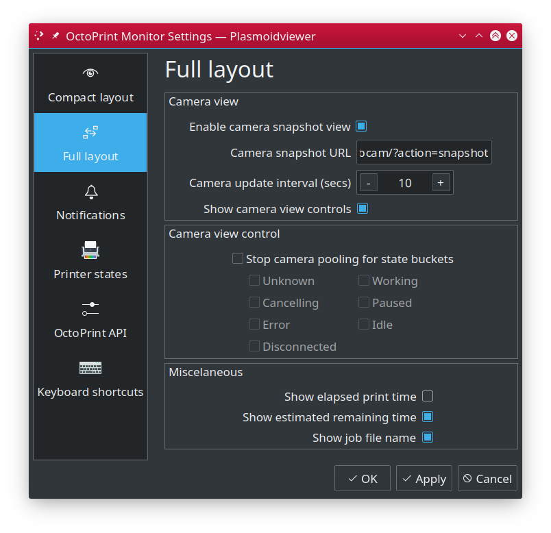
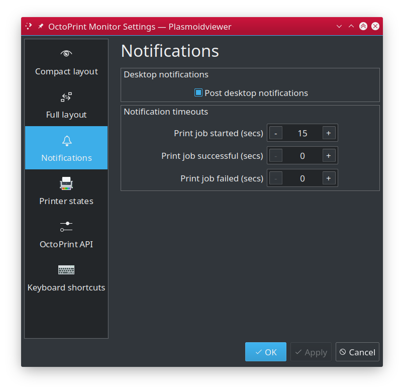

# OctoPrint Monitor for KDE 5 / Plasma #

## Table of contents ##

 * [Main page](../README.md)
   * [Introduction](../README.md#introduction)
   * [Features](../README.md#features)
   * [Screenshots](../README.md#screenshots)
   * [State icons](states.md)
   * **Installation and configuration**
     * [Installation](#installation)
     * [Upgrading](#upgrading)
     * [Configuration](#configuration)
       * [Compact layout](#compact-layout)
       * [Full layout](#full-layout)
       * [Desktop notifications](#desktop-notifications)
       * [OctoPrint API](#octoprint-api)
   * [Troubleshooting](troubles.md)
   * [License](../README.md/#license)
   * [Changelog](../CHANGES.md)

---

## Installation ##

Download `octoprint-monitor.plasmoid` file from
[project Release section](https://github.com/MarcinOrlowski/octoprint-monitor/releases).
Then you can install it either via Panel's GUI, by clicking "Add widgets", then "Get new widgets..."
on the bottom of newly opened widget chooser, then click "Install from local file..." and eventually
selecting downloaded `octoprint-monitor.plasmoid` file.

Alternatively you can install it from command line, by using `kpackagetool5` in your terminal:

    kpackagetool5 --install /PATH/TO/DOWNLOADED/octoprint-monitor.plasmoid 

## Upgrading ##

If you already have `OctoPrint Monitor` installed and just downloaded newer `octoprint-monitor.plasmoid` file,
use `--upgrade` switch of `kpackagetool5` to upgrade your current installation and keep your settings intact:

    kpackagetool5 --upgrade /PATH/TO/DOWNLOADED/octoprint-monitor.plasmoid

**NOTE:** Sometimes, due to Plasma internals, newly installed version may not be instantly seen working,
so you may want to convince Plasma by doing manual reload:

    kquitapp5 plasmashell && kstart5 plasmashell
    
**NOTE:** this will **NOT** log you out nor affects any other apps. 

---

## Configuration ##

### Compact layout ###

This section controls behaviour of the widgets when it is presented in compact form, which is 
used when you put it into your vertical or horizontal panel.

 - **State icon** - graphical state representation (octopus icons)
   - **Disable state icon** - controls visibility of state icon. 
   - **Override maximum state icon size** - by default visible state icons adapts its size to
     dimensions of the container it sits in. In some cases, esp. with vertical panels this may
     cause icon to occupy too much space for no actual benefits. This option lets you set
     max allowed icon size and if the container is bigger, then icon will not grow beyong
     specified dimensions.

- **State text** - textual representation of state
  - **Display text state line** - controls visibility of text state shown usually below the icon.
    This line ususally contains just state bucket name (i.e. "Idle") and print job progress
    percentage (if print job is currently ongoing). Disabling this element hides both types
    of presented information.
  - **Show state bucket name** - you may want to disable state name completely, w/o affecting
    other information presented in this line. If this option is enabled you will not see any
    state info but you may still see the progress percentage.
  - **Hide state text for specific buckets** - you may want to hide this information
    for specific states only to make widgets as small as possible.
  - **Display print progress percentage** - if enabled, will as name indicates show
    percentage of ongoing print job. If nothing is being printed, this element is hidden.

- **Job progress**
  - **Show print job progress bar** - if enabled, small progress bar will be shown as
    soon as print job is started.
  - **Show elapsed print time** - contrils visibiliy of elapsed print time. If there's
    no print job in progress, this info is hidden.
  - **Show estimated remaining time** - displays **estimated** time needed to complete
    ongoing print. This information comes from OctoPrint and, unfortunatelly is often
    not very accurate, so to speak. You may want to disable it and using percentage
    or progress bar instead. If there's no print job in progress, this info is hidden.

> **HINT:** with default settings, active print job is presented as "Printing 12.1%",
> which is somehow redundant as percentage is only shown for active print job. You may
> want to enable "Hide state text for specific buckets" for "Working" bucket. That way
> you will still see all the state names as before, but for printing it will be just
> "12.1%".
  
### Full layout ###

Full layout is being used when `OctoPrint Monitor` is used as regular desktop widget.

 - **Camera view**
   - **Enable camera snapshot view** - if your setup includes OctoPrint connected webcam
     then you may enable this option in `OctoPrint Monitor` to show frequently updated
     snapshots from your webcam directly on your desktop.
   - **Camera snapshot URL** - complete address to OctoPrint snapshot feature. By default
     it should be `http://<OCTOPRINT>/webcam/?action=snapshot` where `<OCTOPRINT>` is either
     IP address of your OctoPrint instance or its domain name (i.e. `octoprint.local` that
     you use). You can find that URL in OctoPrint settings in "Webcam and timelapse" section.
     **NOTE:** note, that OctoPrint uses `127.0.0.1` as IP address in default settings. This
     will of course not work if copied - you must replace `127.0.0.1` by proper IP address
     of your OctoPrint.
   - **Camera update intervals** - specify how frequently you want webcam snapshot view
     to be updated. You may want to increase the interval, to reduce network traffic and
     drop the load off OctoPrint.
   - **Show camera view controls** - enables visibility of "Start/Pause", "Stop" and 
     "Refresh" camera view control buttons.

 - **Camera view control**
   - **Stop camera polling for state buckets** - if enabled, camera snapshot polling
     will stop if printer enters selected states. You may want to i.e. enable this
     option for i.e. "Idle" and "Disconnected" states as most likely there will be nothing
     interesting to watch in these states.  
 - **Misclaneous**
   - **Show elapsed print time** - contrils visibiliy of elapsed print time. If there's
     no print job in progress, this info is hidden.
   - **Show estimated remaining time** - displays **estimated** time needed to complete
     ongoing print. This information comes from OctoPrint and, unfortunatelly is often
     not very accurate, so to speak. You may want to disable it and using percentage
     or progress bar instead. If there's no print job in progress, this info is hidden.
   - **Show job file name** - if enabled, name of currently printer GCODE file will
     be shown in the widget. If there's no print job in progress, this info is hidden.
   
 **NOTE:** You must configure OctoPrint properly and ensure its snapshot URL is accessible
 form other machines in your network (simply check using your browser).   

### Desktop notifications ###

`OctoPrint Monitor` can post desktop notifications to attract user attention. 

 - **Post desktop notifications** - when checked, various events (like printer state changes etc)
   will additionally announced by posting desktop notification.
 - **Notification timeouts**
   - **Print job started** - timeout (in seconds) for desktop notification of new print job started. 
     Setting to `0` means no timeout.
   - **Print job successful** - timeout (in seconds) for desktop notification of successful completion
     of print job. Setting to `0` means no timeout.
   - **Print job failed** - timeout (in seconds) for desktop notification of failed (aborted, stopped,
     printer disconnected etc) print job. Setting to `0` means no timeout.

## OctoPrint API ##

Configure OctoPrint API access here.

 - **API access**
   - **API key** - put OctoPrint "Global API Access Key" here (can be found in "API"
     section of OctoPrint preferences).
   - **OctoPrint API URL** - put full URL to your OctoPrint REST API. This is usually
     construced as `http://<OCTOPRINT>/api` where `<OCTOPRINT>` is IP address or domain
     name of your OctoPrint installation.
 - **Data polling**
   - **Status poll interval** - controls how often `OctoPrint Monitor` will query
     OctoPrint about its status and the printer. 

