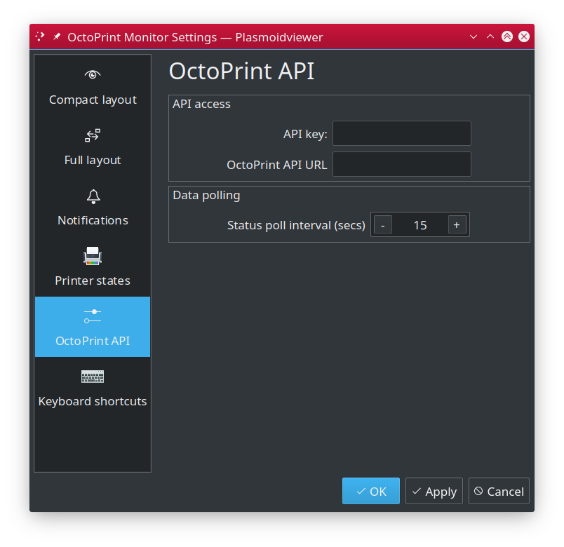

# OctoPrint Monitor for KDE 5 / Plasma #

## Table of contents ##

 * [Main page](../README.md)
   * [Introduction](../README.md#introduction)
   * [Features](../README.md#features)
   * [Screenshots](../README.md#screenshots)
   * **State icons**
   * [Installation and configuration](setup.md)
   * [Troubleshooting](troubles.md)
   * [License](../README.md#license)
   * [Changelog](../CHANGES.md)

   * [Contributions](docs/contributions.md)

---

## State icons ##

`OctoPrint Monitor` aggregates printer and printing job states and produces uniform state reported to you.
For simplicity, we map multiple states into limited number of "state buckets", with dedicated, distinguishable
icon associated. While plain text state report is also available, different icons (additionally, color coded)
help you instantly know the state with just quick look. Detailed information are also available. 

You can face following icons, which representing different type of state.

### Configuration ###

 The **Configuration** state means plasmoid is yet not configured. The base
miminum it requires is OctoPrint API URL and API access key. See [configuration](#configuration) for more information.

### Idle ###
 The **Idle** state means connection to API is good and printer is 
currently connected to OctoPrint but is not printing anything, sitting idle and wasting electricity.

### Working ###
 The **Working** state indicates printer is currently busy working. For that state textual
state indicates state of current print job (i.e. "Finishing"). When printer is printing, additional information
such as progress indicators (both text "Printing (25,1%)" and graphics) will be provided. 

### Cancelling ###
 The **Cancelling** state indicates printer is currently in process of cancelling
active job. It is usually a quick phase, but as it is' not an instant abort, it sometimes may still need a moment
co complete.

### Paused ###
 **Paused** sate tells, the printer is still occupied, but current print job
was paused by user..

### Disconnected ###
 The **Disconnected** state means your printer appears to no longer
be connected with the OctoPrint (or vice versa). This usually means USB cable was disconnected or printer
was simply turned off. OctoPrint in other hand is still up and `OctoPrint Monitor` has no problems talking
to it. Otherwise it would not know the printer went off-line, isnt' it?

### Error ###
 The **Error** state usually means OctoPrint cannot succesfuly talk to the
printer. In most cases this can be related to USB cable falling off its port. 

### Unavailable ###
 The **Unavailable** state indicates API connection issues. If for any reason
`OctoPrint Monitor` is unable to talk to OctoPrint API, it will flag this by using "Unavailable" state. In
most cases it will tell that OctoPrint instance is down or that `OctoPrint Monitor` is incorrectly configured
(most likely double check API URLs). It also can mean connection issues.  

### Unknown ###
 The **Unknown** state is represented by confused rainbow octopus and simply
indicates that `OctoPrint Monitor` is simply unable to correctly determine what is the current state of your printer.
This should only happened during plasmoid's start-up  phase, as it shows "Unknown" state icon unless first API call
is successful. If you see this during normal usage, please fill a bug report as it should not really happen.
